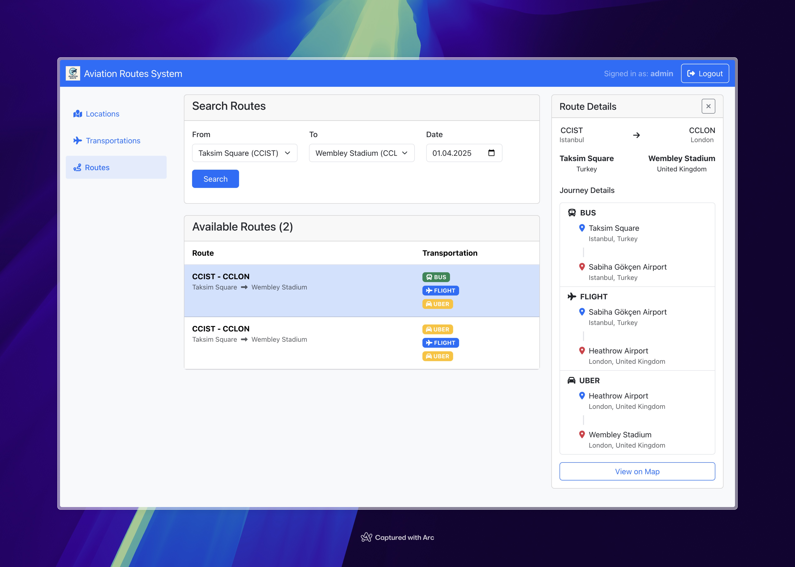

# Aviation Route Finder

Aviation Route Finder is a modern Spring Boot application that provides a route calculation system for the aviation
industry. This system aims to offer users a better experience in flight reservations by calculating all possible routes
from point A to point B.

## Application Preview



## Features

- **Location Management**: CRUD operations for locations such as airports and city centers
- **Transportation Management**: CRUD operations for transportation types like flights, buses, subways, and Uber
- **Route Calculation**: Calculation of all valid routes between two locations on a specific day
- **Role-Based Access Control**: Different access rights for Admin and Agency user roles
- **Redis Caching**: Caching for location, transportation, and route data for high performance
- **RESTful API**: Full API support for all operations with Swagger documentation
- **Responsive UI**: Modern React application for location and transportation management, route search

## Technology Stack

### Backend

- **Java 21**
- **Spring Boot 3.4.4**
- **Spring Data JPA and Hibernate**
- **Spring Security** (Basic Authentication)
- **Spring Cache** (integrated with Redis)
- **PostgreSQL** database
- **Liquibase** for database migrations
- **OpenAPI/Swagger** for API documentation
- **JUnit and Mockito** for unit testing
- **Docker and Docker Compose** for containerization

### Frontend

- **React 19**
- **React Router 7**
- **Axios** for HTTP requests
- **Bootstrap 5 and React-Bootstrap** for UI components
- **Formik and Yup** for form management and validation
- **Font Awesome** for icons

## System Architecture

The system is based on a three-tier architecture:

1. **Presentation Layer**:
    - React-based Single Page Application
    - RESTful API Controllers

2. **Business Logic Layer**:
    - Service classes
    - Domain models
    - Route calculation algorithm

3. **Data Access Layer**:
    - Repository classes
    - Entity classes
    - Redis cache integration

## Valid Route Rules

The following rules apply for a valid route:

1. Each route can have a maximum of 3 transportation vehicles (from origin to destination)
2. Each route must have exactly 1 flight
3. There can be at most 1 pre-flight transfer
4. There can be at most 1 post-flight transfer
5. The selected date must be within the operating days of the transportation vehicles

## Installation

### Requirements

- Java 21 or above
- Node.js 18 or above
- Docker and Docker Compose
- Maven or Gradle

### Backend Setup

```bash
# Clone the repository
git clone https://github.com/yourusername/aviation-route-finder.git
cd aviation-route-finder

# Start database and Redis containers
docker-compose up -d

# Compile and run the application
./gradlew bootRun
```

### Frontend Setup

```bash
# Navigate to the frontend folder
cd frontend

# Install dependencies
npm install

# Start the development server
npm start
```

## API Usage

The application provides the following endpoints:

### Locations

- `GET /api/locations`: List all locations
- `POST /api/locations`: Create a new location
- `GET /api/locations/{id}`: Get a specific location by ID
- `PUT /api/locations/{id}`: Update a location by ID
- `DELETE /api/locations/{id}`: Delete a location by ID

### Transportations

- `GET /api/transportations`: List all transportation vehicles
- `POST /api/transportations`: Create a new transportation vehicle
- `GET /api/transportations/{id}`: Get a specific transportation by ID
- `PUT /api/transportations/{id}`: Update a transportation by ID
- `DELETE /api/transportations/{id}`: Delete a transportation by ID

### Routes

- `GET /api/routes/{originCode}/{destinationCode}/{date}`: Calculate valid routes between two locations on a specific
  date

All APIs require basic authentication:

- Admin users can access all APIs
- Agency users can only access the route listing API

Swagger UI is available at `http://localhost:8080/swagger-ui/index.html` after running the application.

## Caching Strategy

Redis cache is configured according to the following strategies:

- **Locations**: Cached for 1 day
- **Transportations**: Cached for 6 hours
- **Routes**: Cached for 30 minutes

Data changes (additions, updates, deletions) automatically clear the relevant cache.

## Application Structure

```
aviation-route-finder/
├── backend/
│   ├── src/
│   │   ├── main/
│   │   │   ├── java/com/fatihbozik/aviationroutefinder/
│   │   │   │   ├── config/           # Configuration classes
│   │   │   │   ├── domain/           # Domain models
│   │   │   │   ├── mapper/           # Mapper classes
│   │   │   │   ├── persistence/      # Entity classes
│   │   │   │   ├── repository/       # Repository interfaces
│   │   │   │   ├── rest/             # Controllers and API models
│   │   │   │   ├── security/         # Security classes
│   │   │   │   └── service/          # Service classes
│   │   │   └── resources/
│   │   │       ├── db/changelog/     # Liquibase change files
│   │   │       ├── openapi.yaml      # OpenAPI definition
│   │   │       └── application.yml   # Application configuration
│   │   └── test/                     # Test classes
│   └── build.gradle                  # Backend build configuration
├── frontend/
│   ├── public/                       # Static files
│   ├── src/
│   │   ├── components/               # React components
│   │   ├── services/                 # API services
│   │   ├── App.jsx                   # Main application component
│   │   └── index.js                  # Application entry point
│   ├── package.json                  # Frontend dependencies
├── docker-compose.yml                # Docker configuration
└── README.md                         # Project documentation
```

## Sample Configuration

An example configuration of the `application.yml` file:

```yaml
spring:
  datasource:
    url: jdbc:postgresql://localhost:5432/aviation
    username: aviation
    password: password
  jpa:
    hibernate:
      ddl-auto: validate
  liquibase:
    change-log: classpath:/db/changelog/db.changelog-master.xml
  redis:
    host: localhost
    port: 6379
  cache:
    type: redis

server:
  port: 8080

springdoc:
  swagger-ui:
    path: /swagger-ui.html
```

## Contributing

We welcome your contributions! Please discuss your changes by opening an issue before submitting a pull request.

1. Fork the repository
2. Create a feature branch (`git checkout -b feature/amazing-feature`)
3. Commit your changes (`git commit -m 'Add amazing feature'`)
4. Push the branch (`git push origin feature/amazing-feature`)
5. Open a Pull Request

## Testing

To test the application, run the following command:

```bash
./gradlew test
```

Unit tests cover all methods of service classes and especially the route calculation algorithm.

## License

This project is licensed under the MIT License - see the [LICENSE](LICENSE) file for details.

## Contact

Fatih Bozik - [GitHub](https://github.com/fatihbozik)

Project Link: [https://github.com/fatihbozik/aviation-route-finder](https://github.com/fatihbozik/aviation-route-finder)

## Acknowledgements

- [Spring Boot](https://spring.io/projects/spring-boot)
- [React](https://reactjs.org/)
- [Bootstrap](https://getbootstrap.com/)
- [PostgreSQL](https://www.postgresql.org/)
- [Redis](https://redis.io/)
